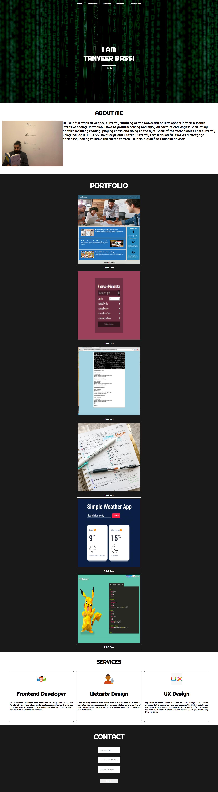
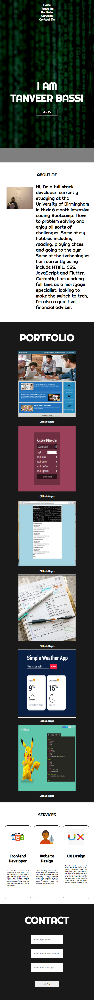

# Portfolio created using HTML and CSS

## Summary

## Below is a project I made to display my recent work and to show of my HTML and CSS skills. Some of the techniques used include Media Query, Flexbox, CCS styling designs and much more!

## Deploy URL

You can find the application deployed to github pages [here](https://tanveerbassi.github.io/portfolio/)

## Technologies

- HTML
- CSS
- GitHub Pages
- Google Fonts

## Screenshots

### Desktop Viewports

### Mobile Viewports

## About Me

I'm a full stack web developer, confident in working with a many technologies.

When I'm not coding, I spend most of my time playing chess, going to the gym and read!

If you'd like to get in touch about a project, please feel free to e-mail me on Tanveer13a551@gmail.com
